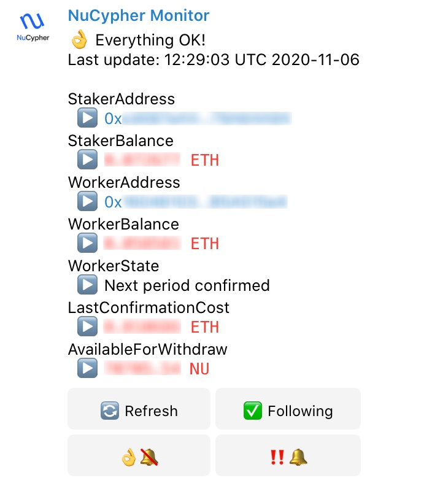

# nucypher-telegram-bot

This is a staker monitor for the Nucypher Network. You can use is directly at [NuCpher Telegram Bot](https://t.me/NuCypherMonitorBot) or deploy your own version.  

I borrowed the Nucypher specific code from [cryptoseal86](https://github.com/cryptoseal86): https://github.com/cryptoseal86/stake-nucypher with some minor adaptations to run it in Node.js

The monitor gets the Staker information from the NuCypher contract using Infura. It also gets the balances of the worker and staker addresses and the gas cost of the last activity confirmation transaction. This could help estimating if the funds for the worker are enough for next period. You can also schedule notifications for your staker address, currently all notifications are trigered at 01:00 a.m. UTC. 

In order to start using the bot, you have to send the command

```
/start YOUR_STAKER_ADDRESS
```

That will return some relevant information about your stake and display a Telegram inline keyboard with some options:

- Refresh (:arrows_counterclockwise:): This button let you refresh the information. The refresh is performed by editing the message so you wont see a notification or a new message, just an animation showing that the information has been refreshed.

- Following (:white_check_mark:): This button will show you information about the scheduled notifications and let you change the settings. If Following is enabled you will see two additional button:

- Green light notifications (:ok_hand:): This controls how to notify when the node is performing properly

- Warning notifications (:bangbang:): This controls how to notify when the node has some problems.

<p  align="center">

</p>

If the bell is enabled (:bell:) you will receive notifications as new messages with the corresponding notifications in your client and the bot will remove the last message so that you only have one message in the chat. In the bell is disabled (:no_bell:) the bot will just update the last message with the new state and information.

If the bot detects some problem with the node, it will schedule another checking after one hour automatically, until the problem is solved.

Currently, the only problem that the bot checks is that the last confirmed period is not greater than the current period. In following versions we might include a notification if the worker balance is close to the last confirmation transaction cost. We are also planning to support in following versions the monitoring of more than one node at the same time.

If you activate the `Following` functionality in the bot it will store in memory your staker address, but if you just use the `Refresh` functionality the bot wont store anything about the node.

## Prerequisites if you want to host your own Bot
  
1. You need to create first a Telegram Bot and get the corresponding TOKEN. Just follow this guide: [Bots: An introduction for developers](https://core.telegram.org/bots) 

2. You also need to get the ChatID of your Bot. In order to get it, start a conversation with your bot and look for the "chat" object and ID property in the list of updates of your bot using the following URL:

```
https://api.telegram.org/bot<YourBOTToken>/getUpdates
```

3. You need to register to Infura and get the Infura endpoint.

## Installation

In order to run the monitor you need to first install [Node.js](https://nodejs.org/). You need to properly set the following environment variables before running the script:

- BOT_TOKEN : The Telegram Bot Token
- INFURA_TOKEN : The token used in the Infura URL, just the token, not he whole URL.
  
1. Open a Terminal and go to some folder where you want to install the monitor

2. Clone this repository

```bash
git clone https://github.com/decentralizedsecurity/nucypher-telegram-bot.git
```

3. Move to the project folder

```bash
cd nucypher-telegram-bot
```

4. Install all dependencies

```bash
npm i
```

5. run the monitor

```bash
node nucypher-bot.js
```

## Running as a service

You could also run the monitor as a system service using `systemctl` o just launch it using `nohup`